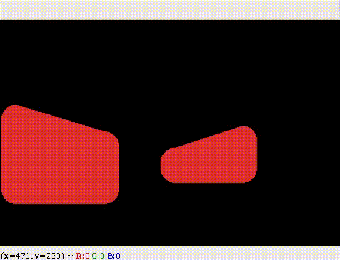

# SJ's face
This is a robot face animated with openCV. Basically, it has two eyes to move toward an inited object (human face in this case), and a neck to move its head (the neck made by 2 mini servo SG90, some cream sticks and glue).
# How it looks ???
In normal mode:   
  
Besides, it has 3 other moods:  
  

# Prerequisites
- OpenCV - definitely
- dlib 19.x
- WiringPi - ```sudo pip3 install wiringpi```
- picamera - ```sudo pip3 install picamera```
# How it runs ???
1. download git ```got clone https://github.com/TannedCung/SJ.git```
2. ``` cd SJ.git```
3. ``` sudo python3 face_tracking.py```
Oh, wait, where is the neck???  
Well, the neck is built with 2 servos SG90 + cream sticks, glue and some wires. Basically, it is a 2 dof robot arm (RR). The wiring diagram would be updated later (forgive me, i'm so lazy at drawing :( )  
And it goes like this  


# How to use the face separately???
- in your new script, ```import eye_move  ```
- creat a new object (say: artist or any thing you want to name it) by ``` artist = Move() ```
- make a while loop
- move the eye to any positions by command ```artist.stare_at(pos)```
- if you want the eyes to bink add this inside while loop  
``` 
if artist.eye_strain():  
   artist.blink()
```
The eyes will blinks every 4 seconds
